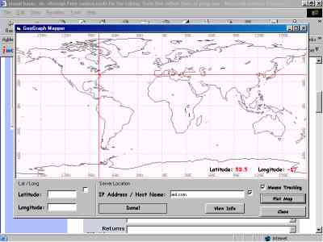



## GeoGraph Updated

### Description

OK Here it is 1 more time, I can't get used to those edit options and I think I deleted the last update. I fixed a lot of the problems, thank you for your feedback. You can now map out private a IP address or Host Name in the united states as well as web address (well most) I added another Whois Server to the search, I will clean it up more in the next update. If you voted for the last submission, please vote again here, I will continue to update this post only. I also fixed the rpoblem with the latitude and longitude display on the map when moving the mouse around. please email me with any bugs you find and enjoy the application. please vote for this code if you like it.
 
### More Info
 

             |
---                |---
**Submitted On**   |2003-02-07 19:12:38
**By**             |[John Phillips](https://github.com/Planet-Source-Code/PSCIndex/blob/master/ByAuthor/john-phillips.md)
**Level**          |Advanced
**User Rating**    |4.9 (59 globes from 12 users)
**Compatibility**  |VB 5\.0, VB 6\.0
**Category**       |[Miscellaneous](https://github.com/Planet-Source-Code/PSCIndex/blob/master/ByCategory/miscellaneous__1-1.md)
**World**          |[Visual Basic](https://github.com/Planet-Source-Code/PSCIndex/blob/master/ByWorld/visual-basic.md)
**Archive File**   |[GeoGraph\_U154087272003\.zip](https://github.com/Planet-Source-Code/john-phillips-geograph-updated__1-43027/archive/master.zip)

